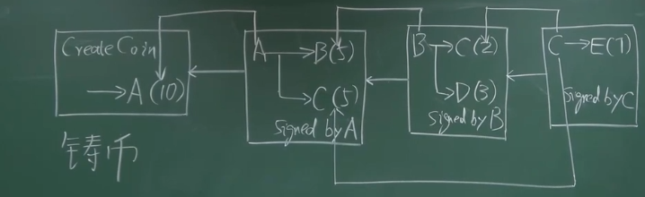
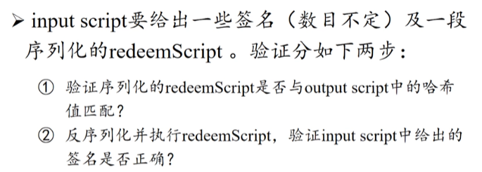
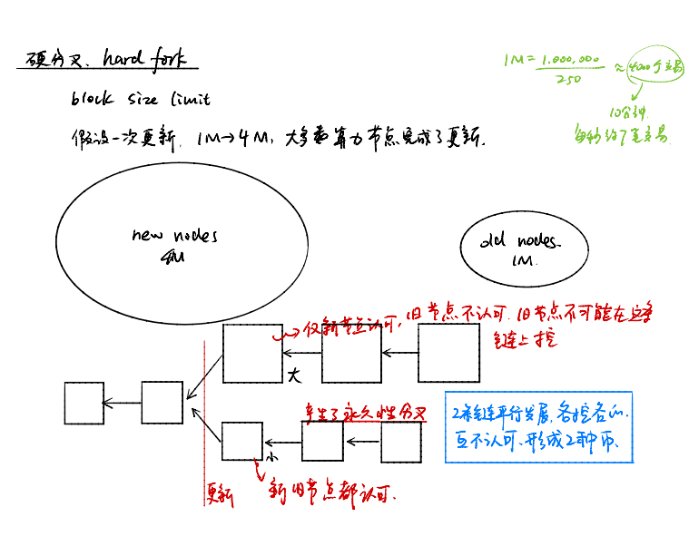

# 区块链技术与应用

数组

列表

二叉树

哈希函数

## BTC中的密码学原理

**cryptographic hash function**

- collsion resistance(碰撞抵抗)

> 碰撞指的是找到两个不同的输入值，使得它们的哈希值相同。也就是说，如果存在任意两个输入x和y，满足x ≠ y，但哈希函数计算后得到的哈希值H(x) = H(y)，那么就存在一个碰撞。
>
> 碰撞抗性的原理在于，对于一个安全的哈希函数，找到一个碰撞是非常困难的。也就是说，计算出一个碰撞的时间和计算哈希函数的时间相比要非常长。这种困难性是基于哈希函数的设计和理论假设，例如散列算法的复杂性、数学难题或者密码学的安全假设。

- hiding

> 哈希函数的计算过程是单向的，不可逆的。但前提要满足输入控件足够大，且分布均匀。通常我们在实际操作中会使用添加随机数的方法。假设给定一个输入值X，可以算出哈希值H(x)，但是不能从H(x)推出X。

- puzzle friendly(只能暴力碰撞)

> 通常我们限定输出的哈希值在一定范围内，即H(block header + nonce) < target （block header是区块链的链头），这个确定链头范围的过程即为挖矿
>
> BTC用的HASH函数SHA-256(Secure Hash Algorithm)

### BTC简单流程

区块头（Block Header）：每个区块都有一个区块头，它包含了一些重要的信息，如前一个区块的哈希值、交易信息、时间戳等。在挖矿中，挖矿节点会对区块头进行计算，以寻找符合特定条件的哈希值。

目标值（Target）：目标值是一个用于控制挖矿难度的参数。它通常表示为一个固定长度的二进制数，在挖矿过程中被用来限定哈希值的范围。挖矿节点的目标是找到一个符合要求的哈希值，使得该哈希值小于目标值。

哈希值计算：挖矿节点会将区块头与一个随机的值（称为nonce）进行组合，然后通过哈希函数对组合后的数据进行计算，得到一个哈希值。该哈希值应该是不可预测且随机的。

比较与验证：计算得到的哈希值与目标值进行比较。如果哈希值小于目标值，则该区块被认为是有效的。挖矿节点将这个有效的区块广播给网络中的其他节点，并将其添加到区块链上。

难度调整：为了保持挖矿的平均时间间隔，比特币等一些区块链系统会根据全网的算力情况动态调整目标值。如果全网的算力上升，目标值将会降低，以增加挖矿难度；如果全网的算力下降，目标值将会提高，以降低挖矿难度。

### 密码学运用

公钥加密和签名：比特币账户使用公钥加密和签名算法，如椭圆曲线数字签名算法（ECDSA）。在创建账户时，会生成一对密钥：==公钥==和==私钥==。

**公钥用于生成账户地址，私钥用于对交易进行签名以验证身份和授权交易。**


助记词和种子短语：助记词（seed phrase）是一串由单词组成的短语，它是通过密码学安全的算法从随机数生成的种子短语（seed phrase）。助记词用于备份和恢复比特币钱包，保证了即使设备丢失或损坏，仍能够恢复钱包和资金。

随机性和密钥生成：比特币账户的密钥对是通过密码学安全的随机数生成算法生成的。安全的随机数是在密码学中至关重要的，确保密钥的随机性和不可预测性，以保护账户的安全性。

防篡改的区块链：比特币使用密码学中的==哈希指针和区块链技术==，确保账户和交易的不可篡改性。区块链的每个区块都包含了前一个区块的哈希值，通过这种链接方式，保证了账户余额和交易历史的可验证性和不可篡改性。


```cpp
区块1
-------
|     |
| 哈希 |
|     |
-------
| 上一个区块的哈希 |
-------------------
|    时间戳      |
-------------------
|      数据      |
-------------------

区块2
-------
|     |
| 哈希 |
|     |
-------
| 上一个区块的哈希 |
-------------------
|    时间戳      |
-------------------
|      数据      |
-------------------

区块3
-------
|     |
| 哈希 |
|     |
-------
| 上一个区块的哈希 |
-------------------
|    时间戳      |
-------------------
|      数据      |
-------------------

```

## BTC的数据结构

### **区块链**

用hash指针代替了普通指针

Block(区块)

> 比特币的区块是由多个交易组成的数据结构。

**区块的哈希计算方法**

1. 获取区块头数据：区块的哈希值是基于区块头（Block Header）计算的。区块头包含了一些重要的信息，包括前一个区块的哈希、交易信息、时间戳等。

2. 拼接数据：将区块头中的各个字段按照特定的顺序拼接在一起。

   通常的拼接顺序是：版本号、前一个区块的哈希、默克尔根（Merkle Root）、时间戳、难度目标和随机数（Nonce）。

3. 哈希计算：对拼接后的数据应用SHA-256哈希函数进行计算。

   计算结果是一个256位的二进制数，通常以十六进制表示。

4. 验证难度目标：将计算得到的哈希值与当前区块链的难度目标进行比较。难度目标是一个固定长度的二进制数，用于控制挖矿的难度。哈希值必须小于难度目标才能满足挖矿的要求。

5. 重复过程：如果计算得到的哈希值不满足难度目标，需要调整区块的随机数（Nonce），再次进行哈希计算。这个过程称为挖矿，旨在寻找符合要求的哈希值。

6. 区块的哈希值：一旦找到满足要求的哈希值，这个哈希值将成为该区块的标识，称为区块的哈希值。


**Merkle Tree**（默克尔树）是一种树状的数据结构，用于有效地验证大量数据的完整性。它在区块链和其他分布式系统中广泛使用。

```
            Root Hash (Merkle Root)
                 /            \
       Hash A                 Hash B
     /       \              /       \
  Hash 1   Hash 2      Hash 3   Hash 4
```

通过默克尔根可以快速验证交易是否被篡改。同时，在区块链中，默克尔树还用于优化存储和同步数据的过程，提高网络效率。

Merkle proof

->验证数据交易的可信链


proof of membership->Merkle proof 

proof of membership->Sorted Merkle Tree

```cpp
class CBlockHeader
{
public:
    // header
    int32_t nVersion;           // 当前使用的比特币版本，不可更改
    uint256 hashPrevBlock;      // 前一个区块的Hash，不可更改
    uint256 hashMerkleRoot;     // MerkleTree的根Hash
    uint32_t nTime;             // 时间戳，因为比特币网络不要求绝对的时间同步，所以这个值可以小范围的调整
    uint32_t nBits;             // 目标阈值，根据协议定期调整
    uint32_t nNonce;            // 随机数
    ......
}
```

## BTC协议

去中心化货币需要解决的两个问题：

1. 数字货币的发行

2. 怎么验证

它的解决方案是

1. 比特币的发行是由挖矿决定的
2. 依靠区块链的数据结构



比特币的发行者 A 拥有铸币权(create coin)，假如发行 10 个比特币，A(10) 分别给 B 和 C 各五个bitcoin → B(5) C(5)，该交易需要有 A 的签名，证明经 A 同意(signed by A)。同时还要说明花掉的10个比特币从哪来的。我们可以看到第二个方框中 A 的钱是从第一个框内铸币交易中来的。

比特币系统中每个交易都包含输入和输出两部分。输入部分要说明==币的来源==，输出部分要给出==收款人公钥的哈希==。

有的交易部分比较复杂，如 C 的货币来源是第二、第三个方框的交易，要标识清楚。

上图就构成了一个小型的区块链，这里有两种哈希指针，一种哈希指针是连接在各个区块之间的，把它们串起来构成一个链表，前面学的就是这种哈希指针。而在该图中还有第二种哈希指针，是指向前面某个交易的指针，用来指明币的来源。

double speeding attack

**为什么要说明币的来源？**：证明币不是凭空捏造的，是有记录的，同时也是为了防范双花攻击（double spending attack）

现在来看第二个方框里 A 向 B 的转账，该交易需要 A 的签名和 B 的地址。**比特币系统里收款的地址是通过公钥推算出来的**。比如 B 的地址就是 B 的公钥取哈希，然后经过一些转换得到的。

A 如何知道 B 的地址呢？比特币系统中没有查询对方地址的功能，必须通过其他渠道。比如某个电商网站，接受比特币支付，就可以公开它的地址或公钥


那如何才能知道 A 的公钥？实际上交易里就包含了。输入时不仅要==输入币的来源，还要输入公钥==。那这就存在了安全漏洞，假如 B 的同伙伪造了这次交易呢？其实第一个方框里铸币交易的输出就有 A 的公钥的哈希，所以第二个方框交易里 A 的公钥要跟前面哈希对的上

上图是对交易系统进行的简化，实际上每个区块(对应图中的每个方框)可以有很多交易，这些交易组成默克尔树（merkle tree）。每个区块分为块头(block header)和块身(block header)。

### 区块


**块头(block header)**

块头是一个固定长度的数据结构，包含了关于区块的元信息。

- 版本号（Version）：表示该区块的版本。
- 上一个区块的哈希（Previous Block Hash）：指向上一个区块的哈希值，用于链接区块链中的前后关系。(Hash of previous block header)
- Merkle 树根哈希（Merkle Root Hash）：是一个哈希值，用于校验区块中所有交易的完整性。
- 时间戳（Timestamp）：记录了区块的生成时间。
- 难度目标（Difficulty Target）：表示该区块的工作量证明难度目标。->挖矿的难度值
- 随机数（Nonce）：用于工作量证明的计算。


Block Body

Merkle Root Hash->保证交易完整性

交易列表（Transaction List）：这是一个包含多个交易的列表，每个交易记录了参与者之间的资产转移和交易细节，如发送方、接收方、金额等。这些交易构成了区块链上的账本数据。

交易（Transaction）： 比特币的交易是指货币或其他资产的转移记录。每个交易都包含以下关键信息：

- 输入（Inputs）：指明要使用的先前交易的输出，以及用于证明拥有这些输出的数字签名。
- 输出（Outputs）：指明将资产发送给的目标地址及其相应金额。
- 锁定脚本（Locking Script）：用于验证发送者拥有先前交易输出的数字签名。
- 解锁脚本（Unlocking Script）：包含发送者提供的数字签名和其他必要信息，以验证交易的有效性。


full node(全节点)->fully validating node保存Block Header和Block Body

light node(手机或者边缘节点只保存block header)


==系统的账本要取得分布式的共识==

分布式的哈希表

distributed hash table


分布式系统的不可能结论

> FLP impossiblity result
>
> FLP（Fischer-Lynch-Paterson）不可能性结果是分布式计算中的一个基本结果，它表明在在asynchronous(异步)网络中，即使只有一个进程崩溃，也不存在能够容忍的确定性共识算法。
>
> 在异步网络中，无法区分一个已崩溃的进程和一个需要任意长时间才能响应的进程。这种不确定性导致了在这种系统中实现一致性的不可能性。

CAP theorem

Consistency(一致性) ->Paxos

Availability 

Partition torlerance

分布式数据系统无法同时提供三个保证：一致性（Consistency）、可用性（Availability）和分区容错性（Partition Tolerance）。


比特币中的共识协议

==工作量证明（Proof of Work，PoW）==：PoW是比特币最早采用的共识机制。它要求节点通过解决一道复杂的数学难题（称为挖矿）来证明自己的工作量，并获得记账权。具有最大计算能力的节点有更高的概率获得记账权，但需要大量的计算能力和能源消耗。


分叉攻击(forking attack)

> 最长合法链
>
> 攻击方法
>
> 长度分叉攻击：攻击者试图创建一个比网络上其他节点更长的区块链分支，以取代原始的区块链。攻击者可能通过控制网络节点、延迟区块传播或者通过其他手段来构造一个具有更长链的分支，从而使其他节点接受这个分支并放弃原有的区块链。


## 比特币系统的实现

比特币是基于交易的账本模式(transaction-based ledger)

UTXO

UTXO全名是Unspent Transaction Outputs，未花费交易输出，它的总体的设计是基于这样一种思路，如果A要花费一笔钱比如100元，这笔钱不会凭空产生，那么必然由B先花费了100元，被A赚到这100元，然后A才能继续花费这一笔钱。这个链条的源头就是先产生这笔钱，在比特币中这被称为铸币（coinbase）。然后会产生这样一个链条，铸币->B->A->? 整个过程从铸币开始，一直可以追溯到当前的状态，当接收到一个UTXO输入的时候，可以基于这个模型判断这笔钱有没有被在别的地方花费过。


手续费和初块奖励(每隔21万个区块奖励减半)

s

account based ledger->以太坊

**挖矿过程的解释**

每次挖矿过程就是一次Bernoulli trail

> a random experiment with binary outcome

每次试nouce求解，构成了Bernoulli process(无记忆性)

> a sequence of independent Bernoulli trait

实验次数很多，每次实验成功率很低->Poisson process

progress free->挖矿公平性保证


**比特币总量**

	


**Bitcoin is secured by mining**

问题：假设大部分算力掌握在诚实的节点手里，可否保证所有写入区块的交易都是合法的？

(记账权)

攻击成功的标志是诚实的节点接受恶意节点的需求

·

双花攻击的防范，6 confirmation


区块链是irrevocable ledger,但这种不可篡改性只是概率上的保证，刚写入Block的交易是容易篡改的


selfish Mining 分叉攻击(减少竞争)

## 比特币网络工作原理

The BitCoin Network 

Application layer(应用层)：运行Bitcoin block chain

network layer(底层)：运行p2p overlay network(节点通信)


比特币的网络设计原则：simple robust but not efficient


每个节点都要维护一个等待上链放入交易的集合

转发交易->flooding(洪泛)  

如果同时接受到两个交易


商家如何防范先后不成功(无法及时支付)

## 区块链的挖矿难度的调整

SHA256

H(block header)<=target

 

挖矿难度太小的问题？

分叉会容易出现，而且不止二分叉，分叉过多对达成共识没有好处，回危害系统的安全性(分散算力)


ETH——>出块速度15秒

分支协议Ghost协议中orphan block不能简单丢弃而是由uncle reward

**如何调整挖矿难度？**

每隔2016个区块(约两周)调整一次目标阈值
$$
target=target*\frac{actual\space time(\text{系统产生2016实际花费的时间)}}{expected\space time(产生2016区块预估的时间)}
$$
比特币算力的变化

	

	

## 比特币挖矿


挖矿设备

第一代：CPU

第二代：GPU

第三代：ASIC(Application Specific Intergreted circuit)

	

要找到nouce，使得其hash值前多少位为0符合要求，矿主只要规定找到nouce使得其hash前60位为0即可获得1个share，最后真挖到BTC后，用share来分享收益

**假设矿池掌握51%的算力，具体可以发动的攻击？**

1.forking attack

> 矿池可以在不被检测到的情况下将一笔交易的货币发送到接收方，并且同时将相同的货币发送到自己的地址。因为矿池拥有绝大部分的算力，所以它们可以更快地产生一个替代链，使得这笔双重支付的交易在整个网络上被确认。
>
> 矿池可以通过先产生一个较长的替代区块链，然后将其与当前区块链进行替换，从而抹去之前确认的交易和块。这可以用来逆转交易或双重支付。

	

2.Boycott


3.盗币->不大可能

 矿池可以选择不在新的区块中包含特定的交易，从而阻止交易的确认。

## 比特币脚本语言

基于栈的语言

	

模式一 P2PK(Pay to Public Key)

```shell
input script:
PUSHDATA(Sig)
output script:
PUSHDATA(PubKey)
CHECKSIG
```

**签名脚本（Signature Script）：** 用于验证你是否拥有私钥的脚本。在比特币交易中，你需要提供一个签名，以证明你有权使用公钥对应的私钥进行交易。

```shell
PUSHDATA(Sig): 将签名数据（Signature）推送到栈顶
# 这个指令用于将签名数据推送到脚本执行环境的栈顶，以便后续操作使用。
# 签名数据是用发送方的私钥对交易数据进行签名得到的，用于证明该交易的合法性和真实性。

PUSHDATA(PubKey): 将公钥（Public Key）推送到栈顶
# 这个指令用于将接收方的公钥推送到脚本执行环境的栈顶，以便后续操作使用。
# 公钥是比特币地址背后的关键组成部分，用于验证由发送方的私钥签名的交易。

CHECKSIG: 验证签名
# 这个指令用于从栈顶获取签名数据和公钥，并验证签名的有效性。
# 它首先从栈顶弹出公钥和签名数据，然后使用公钥验证签名是否与交易数据匹配，
# 如果验证成功，则交易被认为是有效的，可以被添加到区块链上；否则，交易会被拒绝。
```

`

模式二 P2PKH（Pay to Public Key Hash）

```shell
input script:
PUSHDATA(Sig)
PUSHDATA(PubKey)

output script:
DUP
HASH160
PUSHDATA(PubKeyHASH)
EQUALVERIFY
CHECKSIG
```

执行脚本

```
PUSHDATA(Sig): 将签名数据（Signature）推送到栈顶
# 这个指令用于将签名数据推送到脚本执行环境的栈顶，以便后续操作使用。
# 签名数据是用发送方的私钥对交易数据进行签名得到的，用于证明该交易的合法性和真实性。

PUSHDATA(PubKey): 将公钥（Public Key）推送到栈顶
# 这个指令用于将接收方的公钥推送到脚本执行环境的栈顶，以便后续操作使用。

DUP: 复制栈顶元素
# 这个指令用于复制栈顶元素，即复制公钥。

HASH160: 对栈顶元素弹出进行哈希
# 这个指令用于对栈顶的公钥执行哈希操作，得到哈希160值，压入栈

PUSHDATA(PubKeyHash): 将公钥哈希（Public Key Hash）值推送到栈顶
# 这个指令用于将接收方的公钥哈希值推送到脚本执行环境的栈顶，以便后续操作使用。
# 公钥哈希是由接收方的公钥经过哈希函数（如SHA-256和RIPEMD-160）得到的，它是比特币地址的一部分。


# EQUALVERIFY: 比较并验证栈顶的两个元素是否相等
# 这个指令用于比较栈顶的两个元素（发送方提供的公钥哈希和输出脚本中推送的公钥哈希）是否相等。
# 如果不相等，交易将被认为无效，脚本的执行将终止。

# CHECKSIG: 验证签名
# 这个指令用于从栈顶获取签名数据和公钥，并验证签名是否与交易数据匹配，
# 如果验证成功，则交易被认为是有效的，可以被添加到区块链上；否则，交易会被拒绝。

```

·


模式三 P2SH（Pay to Script Key Hash）

采用BIP16的方案

**输入脚本 (Input Script)：**

```
# PUSHDATA(Signature1)
# PUSHDATA(Signature2)
# ... （可能有多个签名数据，根据多重签名的情况）

# PUSHDATA(serialized RedeemScript)
```

**输出脚本 (Output Script)：**

redeem是赎回

```
# HASH160: 对栈顶元素（即RedeemScript）进行哈希
# 这个指令用于对栈顶的RedeemScript执行哈希操作，得到哈希160值。

# PUSHDATA( RedeemScriptHash): 将脚本哈希（Script Hash）推送到栈顶
# 这个指令用于将脚本哈希值推送到脚本执行环境的栈顶。
# 脚本哈希是由RedeemScript经过哈希函数（如SHA-256和RIPEMD-160）得到的。

# EQUAL: 比较栈顶的两个元素是否相等
# 这个指令用于比较栈顶的两个元素（发送方提供的脚本哈希和输出脚本中推送的脚本哈希）是否相等。
# 如果不相等，交易将被认为无效，脚本的执行将终止。
```

	

redeemScript的形式

- P2PK形式
- P2PKH形式
- 多重签名形式


**用P2SH实现P2PK**


执行脚本

第一阶段

FALSE(应对bitcoin已有的Bug)

	

第二阶段

反序列化并展开执行赎回脚本

```
PUSHDATA(PubKey)
CHECKSIG
```


**Proof of Burn**

AltCoin(Alterbative Coin)需要销毁bitcoin


区块链永久保存		

digital commitment

(coinbase只能由有记账权的节点)

	

## 比特币分叉

fork

- state fork(对比特币状态产生分歧)

  - forking attack(deliberate fork)

- protocol fork(因为BTC协议产生分歧而造成的分叉)

  - hard fork

  > 硬分叉是一种比较彻底的协议更新方式。当区块链的规则发生重大改变时，以至于旧版本的节点无法与新版本节点共享交易和区块数据时，就会发生硬分叉。在硬分叉发生后，区块链将被分为两个不兼容的分支，形成两个独立的区块链网络。

  		

  - soft fork

  > 软分叉是一种相对较小的协议更新方式。当区块链的规则进行较小的更改，以至于新版本节点产生的区块和交易仍然可以被旧版本节点接受和处理时，就会发生软分叉。新版本节点产生的区块在旧版本节点看来仍然是有效的，因此整个网络仍然保持一致。
  >
  > - 旧版本节点可以继续与新版本节点共享交易和区块数据，因为新规则是对旧规则的一种扩展。
  > - 不需要全网节点的升级支持，因为旧版本节点可以继续验证新版本节点产生的区块。
  > - 但是，如果大部分网络节点不升级，新规则将无法得到充分利用，因此为了实现软分叉的目的，大多数矿工和节点最好还是升级到新版本。

			

修改coinbase中域的内容

每个区块中都包含一个铸币交易，在该交易中包含一个**coinbase**域。在比特币交易中，这个域是不做检测的，这意味着可以在这个域中随意写入。在《数据结构》章节中介绍MerkleTree时讲过，MerkleTree任意叶子节点的修改都会影响到MerkleTree的根Hash值。因此，当block header中的4个字节的nonce不够用的时候，可以使用其它字节，比如将coinbase域的前8个字节当做*extra-nonce*来使用，这样搜素空间就扩展到了$2^{96}$。

	

软分叉著名例子：P2SH

redeem Script


## 小结

Q1:转账交易的时候如果接受者不在线怎么办

A：只需要接受者的公钥，不需要接受在线


Q2:私钥丢失如何处理？

A:丢了就没了，死钱，有交易所的话，就会由交易所保管，类似


Q3：转账写错地址怎么办？

A:没办法取消交易，转到不存在的地址，也没有办法追回


Q4：既然所有写入区块的交易都需要被验证正确性，那为什么proof of ban中的OP_RETURN(无条件遇到错误)会被区块接受

A:对于某个交易，我们需要验证当前交易的输入脚本和之前交易的输出脚本，而OP_RETURN是写在==当前交易的输出脚本==的，因此本次验证不会被检查到(或者执行到)


Q5:如何防范别的矿工偷取nouce

A:在coinbase tx中，是有收款人地址，若想偷取nouce，需更改地址，会导致Merkle Tree发生改变，从而Root hash改变，从而block header 发生改变，nouce也不一样了(作废了)


## 比特币的匿名性

Bitcoin and anonymity->privacy

pseudonymity(假名)


**可能破坏比特币匿名性的几个方法**

(一)即便一笔交易生成多个inputs和outputs，这些交易也有可能被人为关联

inputs: addr 1(4 BTC)        addr 2(5 BTC)    addr1&addr2一般认为是一个人

outputs: addr 3(6 BTC)       addr 4(3 BTC)    可以分析出addr4是找零钱地址


(二)地址账户和现实世界的真实身份也可能产生关联

地址关联：当用户在不同交易中使用相同的比特币地址时，可能会暴露其交易行为和资金流动。如果有人能够识别特定地址的所有者，那么该用户的交易历史和资金流动就能被跟踪。

比特币的用户在其他社交媒体或网站上透露了与其比特币地址相关的信息，从而将其交易与身份联系起来。

> 防范比特币洗钱：盯住资金的转入转出链


(三)公开交易数据：比特币的交易历史是公开的，所有交易都被记录在区块链上，每个人都可以查看。虽然交易中的参与者不一定是公开的身份，但一旦有人能够将地址与特定的个人或实体联系起来，他们就可以对该用户的交易进行分析和跟踪。


(四)IP地址泄露：在进行比特币交易时，用户通常需要通过与比特币网络连接的节点进行通信。如果用户的IP地址被暴露，他们的交易活动可能会被跟踪和分析。


如何提高匿名性


hide your identity from real world

1. 每次使用新的地址
2. 使用比特币混币服务
3. 使用匿名网络连接(虚拟私人网络或者洋葱网络)
4. 使用CoinJoin：CoinJoin是一种隐私协议，多个用户将交易混合在一起，使得交易更加复杂，难以追踪。


### **零知识证明**

> 零知识证明是指一方(证明者)向另一方(验证者)证明一个称述的正确性，而无需透露与该事实相关的详细信息用于验证某种陈述的真实性，同时不透露关于该陈述的任何其他信息。这种证明方法允许一个主体（证明者）向另一个主体（验证者）证明某个事实的正确性，


同态隐藏

- 如果 $x, y$ 不同, 那么它们的加密函数值 $E(x)$ 和 $E(y)$ 也不相同。
- 给定 $E(x)$ 的值, 很难反推出$x$的值。
- 给定 $E(x)$ 和 $E(y)$ 的值, 我们可以很容易地计算出某些关于 $x, y$ 的加密函数值。
  - 同态加法: 通过 $E(x)$ 和 $E(y)$ 计算出 $E(x+y)$ 的值
  - 同态乘法: 通过 $E(x)$ 和 $E(y)$ 计算出 $E(x y)$ 的值
  - 一扩展到多项式

例子：Alice想要向Bob证明她知道一组数x和y使得x+y=7,同时不让Bob知道x和y的具体数值。

- Alice把E(x)和E(y)的数值发给Bob
- Bob通过收到的E(x)和E(y)计算出E(x+y)的值(利用了性质3)
- Bob同时计算E(7)的值，如果E(x+y)=E(7),那么验证通过，否则验证失败。


**盲签方法**

- 用户A提供SerialNum(暗文),银行在不知道SerialNum的情况下返回签名Token,减少A的存款
- 用户A把SerialNum(明文)和Token交给B完成交易
- 用户B拿SerialNum(明文)和Token给银行(银行不知道币的来源)验证，银行验证通过，增加B的存款
- 银行无法把A和B联系起来。
- 中心化


>
> 盲签名（Blind Signature）是密码学中的一种重要概念，是数字签名和盲化技术的结合。它允许用户在不暴露明文消息内容的情况下，向签名方请求签名，从而保护消息的隐私性。
>
> 盲签名的过程可以简要概括为以下步骤：
>
> 1. 盲化（Blinding）：消息的发送者（通常被称为用户）使用一个随机数（盲化因子）对消息进行盲化操作，产生一个盲化消息。盲化是一种对消息进行变换的操作，使得签名方不能直接得知原始消息。
> 2. 签名请求：用户将盲化后的消息发送给签名方（通常被称为签名者）请求签名。由于消息已被盲化，签名者无法得知实际消息内容。
> 3. 盲化解除：签名者对接收到的盲化消息进行签名，生成签名值，但签名者并不知道实际的消息内容。
> 4. 盲化因子消除：用户通过对签名值进行反盲化操作，使用盲化因子取消盲化，得到签名后的实际签名值。
>
> 最终，用户获得了有效的签名，而签名者对消息的内容一无所知。这就是盲签名的核心原理，它确保了消息的隐私性，同时又提供了签名的有效性。


零币和零钞

- 零币和零钞在协议层就融合了匿名化处理，其匿名属性来自密码学保证。
- 零币(zerocoin)系统中存在基础币和零币，通过基础币和零币的来回转换，消除旧地址和新地址的关联性，其原理类似于混币服务。
- 零钞(zerocash)系统使用zk-SNARKs协议，不依赖一种基础币，区块链中只记录交易的存在性和矿工用来验证系统正常运行所需要关
  键属性的证明。区块链上既不显示交易地址也不显示交易金额，所有交易通过零知识验证的方式进行。


## 比特币引发的思考

Hash Pointer 指针只是形象的说法，实际系统只有hash没有指针

```cpp
/** Nodes collect new transactions into a block, hash them into a hash tree,
 * and scan through nonce values to make the block's hash satisfy proof-of-work
 * requirements.  When they solve the proof-of-work, they broadcast the block
 * to everyone and the block is added to the block chain.  The first transaction
 * in the block is a special one that creates a new coin owned by the creator
 * of the block.
 */
class CBlockHeader
{
public:
    // header
    int32_t nVersion;
    uint256 hashPrevBlock;
    uint256 hashMerkleRoot;
    uint32_t nTime;
    uint32_t nBits;
    uint32_t nNonce; 
```

(key,value)->levelDB


区块恋

把私钥分成两份,表示感情

> 注意
>
> 截断私钥的方法会降低安全性，而要用多重签名的方法

三、分布式公式

为什么比特币系统能够绕过分布式共识中的不可能结论？

比特币并没有取得严格意义的共识:如分叉

四、比特币稀缺性

五、量子计算


## 参考文献

[bitcoin/src at master · bitcoin/bitcoin (github.com)](https://github.com/bitcoin/bitcoin/tree/master/src)

https://www.bilibili.com/video/BV1Vt411X7JF?p=1


# 区块链 2.0

## 以太坊概述

**相对于比特币的几点改进**

1. 缩短出块时间至10多秒
2. ghost共识机制
3. mining puzzle
   - BTC:计算密集型
   - ETH：memory-hard(限制ASIC)
4. proof of work->proof of stake
5. 对智能合约的支持
   - BTC：decentralized currency
   - ETH：decentralized contract(去中心化合约) 优势


## 以太坊账户

比特币是基于交易的账本模式(transaction-based ledger)，每笔交易都是由输入和输出构成的。输入引用先前交易的输出，以证明发送者有权使用这些比特币。而输出则指定接收方地址和转移给接收方的比特币数量。因此要想知道余额，要去UTXO找关联账户


	


> 举个例子：
>
> 假设Alice拥有10个比特币，她想将其中3个比特币发送给Bob。这将产生一笔交易，输入是10个比特币（来自Alice之前的交易输出），输出是3个比特币（给Bob）和7个比特币（返回给Alice自己，因为剩下的比特币必须归还给发送方）。
>
> 当这笔交易被确认后，系统中不再存在先前的10个比特币的“账户余额”概念。相反，账本中将存在两个未使用交易输出：一个是给Bob的3个比特币，另一个是给Alice的7个比特币。这些未使用的交易输出可以用于构建下一笔交易。


以太坊系统是基于账户的模型(account-based ledger)

在基于账户的账本模式中，区块链记录着各个账户及其相应的余额。每个账户都有一个地址（类似于银行账户号码）和与之相关的以太币余额。当以太坊网络上发生交易时，涉及的是在不同账户之间转移以太币。


> 假设账户B想要向账户C发送以太币。一笔交易被创建，指定了发送方（账户B）、接收方（账户C）以及要转移的以太币数量。交易被确认并添加到以太坊区块链的一个区块后，账户余额相应地进行更新。以太币从账户B的余额中减少，同时同样的数量被增加到账户C的余额中。

**account based模式的优点**

1. 符合人的主观感受和现行银行交易类似
2. 可以防范double speeding attack
3. 高可扩展性：基于账户的模式在处理大量交易时有较好的扩展性。由于不需要跟踪每个交易的UTXO，交易处理速度相对较快，从而提高了整个网络的吞吐量。


**account based模式的缺点**

1.replay attack(nonce计数器)

`

2. 在账户模式下，需要存储每个账户的余额和状态信息。随着账户数量和交易量的增加，需要更大的存储空间来保存所有账户的信息，这可能会导致存储成本的增加


**账户类别**

外部账户(externally owned account)

- balance 
- nonce

> 外部账户也被称为EOA账户或用户账户。它们是由用户生成和控制的标准账户，通过私钥和公钥来实现身份认证和交易签名。
>
> - 每个外部账户有一个对应的以太币（ETH）余额，可以发送和接收以太币。
> - 外部账户可以用于参与普通的货币交易，例如转账以太币给其他账户。
> - 外部账户通过私钥签署交易，然后将交易广播到区块链网络。


Smart contract account(合约账户)

- balance 
- nonce(一个合约可以调用另外一个合约，因此通过nonce记录调用的次数)
- code
- storge(调用过程会改变)


> 合约账户是一种由智能合约代码控制的特殊账户，它们不依赖于私钥和公钥进行身份认证。
>
> - 智能合约是一种以编程方式定义的自动执行的计算机代码，能够根据预设规则和条件执行交易或实现特定功能。
> - 智能合约代码被部署到以太坊上，生成一个合约账户，并分配一个以太币余额用于支付交易执行的成本（称为“燃气”费用）。
> - 合约账户可以处理复杂的业务逻辑和多方交互，可以实现更为复杂的去中心化应用（DApps）。


智能合约要求有稳定的账户参与

## 以太坊中的状态树

	

思路一:使用hash表查询

存在问题:每次出现新交易打包进区块中，从而改变Merkle tree，但事实上只有一部分发生改变，一部分改变要重写整个Merkle tree

(另外由于BTC)

思路二：直接使用Merkle tree存取账户，要改直接改merkle tree，是否可行？

- merkle tree查找效率低
- 不排序，存在的问题：当计算叶节点顺序不能达成一致(BTC的顺序是由拥有铸币权的节点决定的)


如果使用sorted merkle tree呢？

插入账户时，merkle tree的重构代价很大


### **MTP结构**

Trie结构(Trie是一种用于存储和快速检索键值对的树状数据结构，通常用于高效地存储大量的关联数据。)可以类比信号的状态转移


trie结构的特点：

1. 打乱顺序，trie结构不变
2. 具有很好的更新操作局部性

trie缺点：存储浪费，部分内容效率低(键值的分布稀疏)


Patricia Tree(压缩前缀树)经过了路径压缩的树


树的高度明显减少(如果树的分布很稀疏，较为明显)


disintermediarion(去中介)

为了防止哈希碰撞，所以地址设置为$2^{160}$这么大


**Merkle Patricia Tree**

把普通指针换成了哈希指针


根节点（Root Node）：状态树的根节点是一个哈希值，用于表示整个状态树的当前状态。所有账户状态数据都通过这个根节点的哈希值进行唯一标识。

分支节点（Branch Node）：分支节点是状态树中的中间节点，用于连接不同的叶子节点或其他分支节点。每个分支节点有17个子节点，对应了16进制数字0-15和一个特殊节点（NIL节点）。每个子节点保存一个哈希值，指向下一级的分支节点或叶子节点。

叶子节点（Leaf Node）：叶子节点包含了账户的具体状态信息。每个叶子节点对应一个账户地址，保存了与该地址相关的账户状态数据，如余额、代码、存储等。

这种状态树的结构使得以太坊能够高效地跟踪和维护账户的状态，同时也有助于实现轻客户端验证和状态证明等功能，从而提高整个网络的可扩展性和安全性。


以太坊实际用的结构是==modified MPT==

根节点哈希值存在块头


每次发布区块时，状态树中新节点的值会发生改变，这些改变是局部的

共享分支

·

问题：为什么保留历史状态，不在原先数据上进行修改？

答：为了回滚，在ETH中分叉是常态，orphan block中的数据都要向前一状态回滚，而由于ETH中有智能合约，为了支持智能合约的回滚，必须保持之前的状态


区块头结构


发布的信息


状态树保存的是(key,value),上面讲的都是key保存的地址，那么Value呢？

经过RLP(Recursive Length Prefix)序列化再存储

**只做nested array of bytes**


## 区块链的交易树和收据树

状态树：是包含多个区块的状态

交易树和收据树(独立的区块的交易和交易结果)的作用：

1. 提供merkle proof

2. 支持更复杂的查询操作->e.g.支持查找过去10天和某个智能合约相关的交易

   解决方案：引入了bloom filter数据结构(有可能出现false postive(误报)，而不会出现false passive(漏报))


bloom filter数据结构

布隆过滤器（Bloom Filter）是一种概率型数据结构，用于快速判断一个元素是否属于某个集合。它可以高效地检索元素，同时占用较少的内存空间。布隆过滤器的主要应用场景是在大规模数据集中进行快速查找和过滤操作。


ETH有关bloom filter的具体操作

每个交易执行完后会形成一个收据，收据中包含一个bloom filter记录这个交易的类型，地址等其他信息

发布的区块在块头有一个中的blooom filter这个总的bone filter是啊，该区块中所有交易的bone filter的并集
