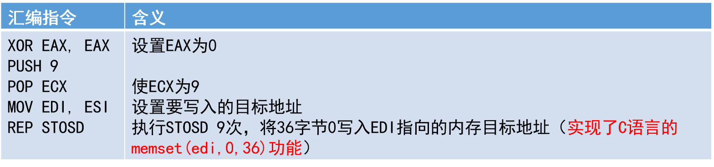
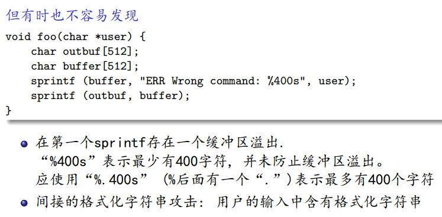
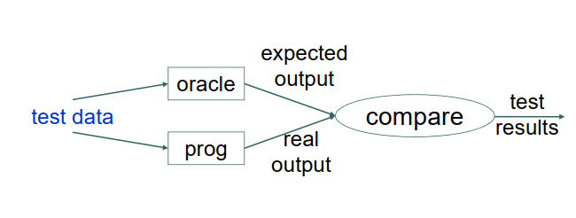

# 软件与系统安全复习

**课程复习内容**

其中


## 软件与系统安全基础

### 威胁模型

> 对于影响系统安全的所有信息的结构化表示  

本质上，是从安全的视角解读系统与其环境

用于理解==攻击者==

- ==什么可信、什么不可信==
- ==攻击者的动机、资源、能力；攻击造成的影响==

具体场景

接受客户端请求的Web服务器

可信：Web服务器

不可信：客户端

- 客户端可能发送恶意输入
- 客户端可能发起拒绝服务攻击
- 客户端有可能接管Web服务器：提取，入侵等

**威胁建模**

> 捕获、组织和分析这些影响系统安全的信息的过程

结构化推理攻击面

- 确定入口点
- 从攻击者的角度审视系统
  - 分析、识别系统结构
  - 确定各种威胁及威胁严重程度
  - 确定对策和缓解措施

**漏洞、攻击与危害**

漏洞(Vulnerability):可以被对==缺陷==具有==利用能力的攻击者====访问==并利用的缺陷

攻击：攻击者尝试利用漏洞

- 主动、被动、DDOS

危害

攻击成功则危害发生

### 安全策略与策略执行


**安全策略**

- 允许什么、不允许什么

- 谁被允许做什么

安全策略是一个系统所应具备的安全属性的高层次规约

安全策略模型是安全策略的简明(规范化)描述  


**策略执行**

- 为了安全策略被遵守，需要做什么

- 策略执行的方法: 利用某些“机制”(mechanism)
  - 说服
  - 监控和威慑
  - 技术上禁止 (这是我们最感兴趣的)
  - 激励管理


#### 安全策略CIA模型

==机密性（Confidentiality）==

- 数据机密性，未授权者无法访问

- 隐私性

> 信息仅能被授权者知道

==完整性（Integrity）==

- 数据完整性
- 系统完整性

> 系统中存储的信息是正确(未被篡改的), 攻击者无法修改被保护的信息  

==可用性（Availability）==

- 保证系统及时运转，保证不会拒绝已授权用户

> 当需要信息或服务时, 信息或服务可用, 攻击者无法阻碍计算过程  

`举个栗子`

1. Carol将Angelo的支票的数额从100改为1000：
   - 违反完整性：由于金额被更改，支票的数据已被篡改，损害了支票的完整性。
2. 李雷在抄韩梅梅的作业：
   - 违反机密性：李雷未经韩梅梅的允许访问和复制她的作业，侵犯了韩梅梅的个人隐私和机密性。
3. 张三注册了域名`xidian.edu.cn`，且拒绝让西电购买或使用此域名：
   - 违反可用性：张三注册了`xidian.edu.cn`域名并拒绝让西电购买或使用，导致西电无法使用该域名作为其官方网站，损害了西电的可用性

其他安全目标

- 隐私

- 非否认性或可追责性

## 技术基础

IA-32: 32位版本的x86指令集体系结构  

**字节序**

需要存储的数字`0x12345678`


### 内存模型

**IA-32内存模型**

程序内存由一系列独立的地址空间（称为“段”）组成。代码、数据和栈在不同的段中

逻辑地址=段选择器+偏移量

> ip寄存器读取指令的时候，实际上是cs:ip，通过sp寄存器访问栈的时候，实际上是ss:sp。

**分段内存模型**


==保护模式下的内存管理==: 分段（必须）+ 分页（可选）

现代的`IA32`下添加的特殊段选择器:GS FS

段寄存器里面存放的不再是段基地址，而是一个叫**段选择子**的东西。


程序线性地址空间≤4GB, 物理地址空间≤64GB

每个段最大 232 字节, IA-32 程序最多使用 16383 个段

- 物理地址是CPU访问的实际内存位置

- CPU的内存管理单元(MMU)透明地将虚拟地址(逻辑地址)转换为物理地址


`X86 Linux`系统的线性地址空间分层

为了充分利用和管理系统内存资源，Linux采用虚拟内存管理技术，利用虚拟内存技术让每个进程都有`4GB` 互不干涉的虚拟地址空间。

进程初始化分配和操作的都是基于这个「虚拟地址」，只有当进程需要实际访问内存资源的时候才会建立虚拟地址和物理地址的映射，调入物理内存页。

### 寄存器与数据类型

**通用寄存器**

EAX:（操作数和结果数据的）AX 

累加器 `EBX`:（在DS段中数据的指针）基址寄存器 

`ECX`:（字符串和循环操作的）计数器 

`EDX`:（I/O指针）数据寄存器 

`EDI`: 变址寄存器, 字符串/内存操作的==目的地址==

`ESI`: 变址寄存器, 字符串/内存操作的==源地址== 

EBP:（SS段中的）栈内数据指针, 栈帧的基地址, 用于为函数调用创建栈帧 

ESP:（SS段中的）栈指针, 栈区域的栈顶地址


**指令指针寄存器**

- x86 上 32 位的 EIP, 存放当前代码段中将被执行的下一条指令的线性地址偏移
- 程序运行时, CPU 根据 CS 段寄存器和 EIP 寄存器中的地址偏移读取下一条指令, 将指令传送到指令缓冲区, 并将 EIP 寄存器值自增, 增大的大小即被读取指令的字节数
- 不能直接修改EIP,修改途径：
  - 指令JMP，Jcc,CALL,RET
  - 中断或异常

**RIP 相对寻址**
x64 允许指令在引用数据时使用相对于 RIP 的地址，常用于访问全局变量, 全局变量 a 常通过 a(%rip) 进行访问


**数据类型**


**==栈帧==**

是将调用函数和被调用函数联系起来的机制, 栈被分割为栈帧,栈帧组成栈。栈帧的内容包含

- 函数的局部变量
- 向被调用函数传递的参数
- 函数调用的联系信息(栈帧相关的指针：栈帧基址针，返回指令指针)


CALL指令语义(及后继指令语义)

- 将EIP的当前值(返回指令指针)压栈

- 将CALL的目标指令（被调用函数的第一条指令）的地址偏移载入EIP寄存器

- CALL指令结束后开始执行被调用函数
  - PUSH EBP: 将调用函数的栈帧的 EBP 压栈
  - ESP -> EBP，确立新栈帧（被调用函数栈帧）的基址针
  - 执行被调用函数的具体功能

- RETN指令执行之前
  - EBP -> ESP: 清空当前被调用函数的栈帧(此时ESP指向的栈顶内容恰好为调用者函数的EBP)(可选)
  - POP EBP: 将EBP恢复为调用者函数的原始EBP

- 将栈顶的内容（返回指令指针）弹出到EIP

- 若RETN指令有参数n, 则将ESP增加n字节, 从而释放栈上的参数恢复对调用函数的执行

**栈帧基指针**: 由 `EBP` 指向的被调用函数栈帧的固定参考点

**返回指令指针**: 由 CALL 指令压入栈中的 `EIP` 寄存器中的指令地址


### 指令集和调用惯例

**汇编代码风格**

**AT&T**: source在destination前

在较早期的GNU工具中使用

**Intel**: destination在source前, “[. . .]”含义类似于解引用

```assembly
#AT&T
mov $4,%eax		
mov $4,%(eax)	
#Intel
mov eax,4
mov [eax],4
```


- 代码段：存放可执行程序的代码，可读不可写
- 数据段：存放程序中已经初始化的静态（全局）变量，可读写

- bss段：存放程序中未初始化的静态（全局）变量，可读写

- 堆（heap）：存放动态分配的内容，需要程序猿手动分配和释放

- 栈（stack）：存放局部变量，如函数的参数、返回地址、局部变量等，有系统自动分配和释放

- 栈增长方向：高地址->低地址

- ESP：栈指针寄存器，指向栈顶的低地址

- EBP：基址指针寄存器，指向栈底的高地址

- EIP：指令指针，存储即将执行的程序指令的地址


**IA-32指令编码**

即二进制编码，汇编


Mode R/M:操作数类型。R：寄存器；M：内存单元 

SIB：当出现基址加变址寻址或者基址寻址时要用到 Scale Index Base

立即数：用于操作数为常量值的情况
$$
Address=Reg[Base]+Reg[index]*2^{Scale}+Displacement
$$


举例

`MOV EAX [ESI+ ECX*4 + 4]`

Scale: 4($2^{Scale}$一般是1,2,4,8)

Index: `ECX`

Base: `ESI`

偏移量：4


MOVS(MOVSB/MOVSW/MOVSD): 用于实现字符串或内存的复制 

 

SCAS: 用AL/AX/EAX减去[EDI]，更新EFLAGS，并对EDI自增/自减


STOS: 将AL/AX/EAX的值写入EDI指向的内存



CMP: 算数比较

- 比较两个操作数(通过相减), 并设置EFLAGS中的适当标识位

- 常与条件跳转Jcc指令配合使用, 跳转依据即CMP运算结果

TEST: 逻辑比较

- 比较两个操作数(通过逻辑AND运算), 并设置EFLAGS中的适当标识位

JMP: 无条件跳转到目标指令地址(可用相对地址或绝对地址）


**函数调用惯例**

| 调用方式   | 参数传递                                                     | 栈清理   | 常用场景  |
| ---------- | ------------------------------------------------------------ | -------- | --------- |
| `cdecl`    | 从右到左压栈，返回值由`EAX`返回                              | 调用者   | C语言     |
| `stdcall`  | 从右到左压栈                                                 | 函数自身 | Win32 API |
| `fastcall` | 左边两个参数分别放在`ECX`和`EDX`寄存器，其余的参数从右到左压栈 | 函数自身 |           |

在调用一个函数时，系统会为这个函数分配一个栈帧，栈帧空间为该函数所独有。

函数==调用一个函数==的大致过程

- 函数参数从右到左入栈
- 返回地址入栈，esp向下移动，为返回地址腾出空间
- 上一函数ebp入栈，新的ebp被设置为当前栈指针esp的地址，以成为新栈帧的基址指针


==函数执行过程==中的栈操作：

- 在函数执行过程中，根据函数的需求，esp 的值可能会不断变化，以进行栈上的数据操作。
- 通过减小 esp 的值，为局部变量和临时数据分配空间。
- 通过增加 esp 的值，释放先前分配的空间。
- 通过将数据压入和弹出栈来进行参数传递和函数调用。

==函数返回时==：

- 弹出临时变量

- 当函数执行完毕并准备返回时，处理器会恢复旧的ebp值，将其存入到ebp寄存器的值，以恢复到调用者的栈帧。
- 返回地址从栈中弹出，存入到`eip`寄存器中，将控制权返回给调用者。
- 最后，ebp 和 esp 的值恢复到调用者栈帧的位置，以指向调用者栈的正确位置。

> ==注意==
>
> 调用函数的参数入栈后是通过ADD ESP回收栈的

**System V amd64优化**

前6个参数通过RDI, RSI, RDX, RCX, R8, R9传递  

==Red-Zone==优化

rsp指针向下(低地址)的128字节栈空间可保留为不被信号或中断处理程序更改, 从而作为函数的临时数据空间, 称为red zone  


**中断指令**
中断: 通常指由I/O设备触发的异步事件

异常(exception): CPU在执行指令时, 检测到一个或多个预定义条件时产生的同步事件

- 故障 (fault): 可修正的异常。故障处理后执行产生故障的指令
- 陷入 (trap): 调用特定指令（如SYSENTER）时产生的异常。陷入处理后执行产生陷入的指令的下一条指令


**中断和异常的处理**

中断与一个索引值相关, 该索引值是一个函数指针数组(==中断向量表==IVT/中断描述符表IDT)的索引, 当中断发生时,CPU执行对应索引处的函数, 然后恢复中断发生前的执行


**控制流图**

节点：由一系列汇编指令组成的基本块

- 一个基本块由一系列顺序执行的汇编代码组成, 其间没有跳转指令,也没有其他外部跳转指令以其间为跳转目标

有向边：连接各基本块

- 从基本块b1到基本块b2的有向边的含义是：在执行完b1后,有可能开始执行b2从

一个基本块可以发出多条有向边

- 例如, 当该基本块的最后一条指令为条件跳转指令时

### ELF

**可重定位文件**(.o)

其代码和数据与其他对象文件进行链接, 以构造.so文件或可执行文件

**共享对象文件**(.so)

链接器(ld)可将其与其他.o和.so文件共同创建新的对象文件;

动态链接器可以将多个.so与可执行文件结合以创建进程映像


**对象文件的试图**

由于对象文件参与程序的链接和执行，因此ELF格式提供两个并发的视图


**ELF头**

节头表(Section header table)

- 用于链接视图

- 将文件的主体看作一系列的节(section)

程序头表(Program header table)

- 用于执行视图

- 将文件的主体看作一系列的段(segment)

### 代码混淆

**混淆(Obfuscation)**

- 通过重构增加代码逆向分析难度的技术

- 混淆是一种程序变换  


- 存在不同的混淆/解混淆模型
- 输入程序与输出程序应在语义上等价
- 可以在不同层次进行：源代码级，汇编/二进制级,中间代码/字节码级


**理论上的安全性**

完美混淆器: 一个概率算法$O$, 该算法满足以下三个条件

- 功能性：对于每个$P$,字符串$O(P)$是一个功能与$P$相同的程序
- 多项式减速：相较$P$而言，程序$O(P)$的时间和空间开销，最差情况下呈多项式级放大
- 虚拟黑盒:任何拥有对$O(P)$文本的访问权限的概率多项式时间算法(攻击者)，都无法比一个对$P$拥有oracle访问权限的概率多项式时间算法推断出更多的东西
  - 算法(攻击者)对程序拥有oracle访问权限: 指算法(攻击者)可以将程序当作黑盒使用, 对任意输入x, 可在多项式时间内获得输出P(x) 
  - 白盒攻击上下文(WBAC): 攻击者可以在一个他能够完全控制的环境下执行应用程序  


- 满足虚拟黑盒属性的完美混淆器不存在  

- 只需要使逆向分析成本大于可能收益


**代码混淆应用场景**

- 恶意软件

  通过代码混淆绕过杀毒软件和逆向工程师的审查

- 软件防篡改和保护代码等知识产权


**数据混淆：常量展开**

假定在输入程序中用到了一个常量，混淆器可将该常量替换为某个计算过程，这个计算过程的结果是该常量

```assembly
push 0F9CBE47AH
ADD DWORD PTR [ESP], 6341B86H
#等价于
PUSH 0H
```


**数据混淆: 数据编码方案**

设定一个编码函数y = f(x)

- 混淆时，将代码中的数据x0混淆为f(x0)

- 解混淆时（运行时处理到f(x0)），将代码中的f(x0)恢复为x0

对编码函数y = f(x)的选择要求

- 从任意y0 = f(x0)难以推断出x0

- 或从任意的(x0, y0)难以推断出编码函数f

提高混淆强度

- 多项式编码
- 剩余数编码
- 同态
  - 一般的编码运行时还需要进行动态解码
  - 希望能够直接在编码后的代码上直接实施运算

对于编码后的变量定义一个等价运算, 使得对编码后变量的运算结果等于编码前变量运算结果的编码  

**同态**

对于编码后的变量定义一个等价运算，使得编码后变量的运算结果等于编码前变量运算结果的编码

- 在抽象代数中，两个群$G$和$H$分别支持$+_g$和$+_h$运算，同态是$G$到$H$之间的映射$f$使得$f(x+_gy)=f(x)+_hf(y)$

- 同态可以泛化到任何代数结构
- 全同态：对运算没有任何限制的映射

混淆是全同态的一个应用

- 未编码域->源代数$G$
- 编码域->目标代数$H$

构造变换，将一条或多条相邻指令映射为具有相同语义的更复杂的指令序列

高级语言上的语义等价示例

| 运算             | 等价运算                 |
| ---------------- | ------------------------ |
| -x               | ~x+1                     |
| rotate left(x,y) | (x<<y)\|(x>>(bits(x)-y)) |
| x-1              | ~(-x)                    |
| x+1              | -(~x)                    |

控制流混淆: 二进制静态分析对控制流的假定

- CALL指令只用于函数调用, 且调用目标即函数的起始地址

- 绝大多数函数调用会返回, 且返回到CALL指令的后一条指令的位置; RET和RETN代表函数边界

- 遇到条件跳转时, 假定: 分支两侧均可能被执行; 分支两侧均为代码而非数据

- 容易确定间接跳转的目标地址

- 只有switch结构能够生成间接跳转; 只有对函数指针的调用能够生成间接调用

- 所有控制转移目标地址都是代码而非数据

- 异常以一种可预测的方式使用

> 控制流混淆通过打破这些假定中的一些假定来增大软件逆向的难度

**组合使用函数内联和外联**

函数内联：将子函数代码合并到调用该函数的调用者代码的每个调用点

- 打破目的地址

函数外联：将代码的一部分提取出来构成单独的函数


**通过跳转破坏局部性**

向基本块中加入无条件跳转，破坏局部性的模式


**不透明谓词**

一种特殊的条件表达式，该条件表达式的值仅在编译时或混淆时已知(对于加混淆者来说容易判断)

- $P^T$:取值为True的不透明谓词
- $P^F$:取值为False的不透明谓词
- $P^?$:取值为True或者False的不透明谓词

将不透明谓词作为分支条件, 向CFG中加入额外的伪分支


```python
def opaque_predicate(x):
    result = ((x ^ 0x5A) & 0xFF) + 0xC3
    return result % 2 == 0

def main():
    secret_value = 42
    if opaque_predicate(secret_value):
        print("Access granted!")
        print("I will now reveal the secret to you!")
        # ...
    else:
        # 无关紧要的代码块
        print("Access denied!")
        # ...

main()
```


控制流混淆：**插入无效代码**

在两段有效代码之间插入一些无效代码

- 对数据混淆->死代码的插入
- 控制流混淆->插入到不会执行的程序分支->垃圾代码插入

> 死代码消除: 与死代码插入相对应的编译优化技术

垃圾代码通常被引入到特定的程序分支上, 与跳转指令共同作用,看似引入了一个新的分支

JMP <目标地址> <垃圾代码>

目标地址: 有效代码

更隐蔽的插入方法: 与数据混淆相结合, 通过==引入寄存器==操作,

将无条件跳转伪装为条件跳转

```assembly
PUSH EAX
XOR EAX, EAX
JZ <目标地址>
<垃圾代码>
目标地址: POP EAX
```

无效的条件跳转

```assembly
JZ <目标地址1>
JMP <目标地址2>
...
目标地址1: NOP ;或等价于NOP的语句序列
目标地址2: 有效代码
```


控制流混淆: **基于处理器的控制流间接化**

> 选择间接跳转点：在代码中选择一些关键的跳转点，如函数调用、条件分支等。这些跳转点是程序的关键控制流决策点。
>
> 替换为间接跳转：将直接跳转指令替换为间接跳转指令，如函数指针调用、虚函数调用等。这些间接跳转指令将控制流的决策推迟到运行时。
>
> 控制流目标混淆：通过修改间接跳转的目标地址或使用一些额外的指令进行控制流变换，使得控制流路径变得复杂和难以预测。这可以使用加密、动态计算、代码生成等技术来实现。
>
> 解密或计算目标地址：在运行时，解密或计算间接跳转的目标地址，以便执行正确的控制流路径。这可以通过一些密钥或算法来实现。

```c
#include <stdio.h>

void secret_function() {
    printf("Access granted!\n");
    // 关键代码块
    // ...
}

void public_function() {
    printf("Access denied!\n");
    // 无关紧要的代码块
    // ...
}

void encrypt_function_pointers(void (*func_ptr)()) {
    unsigned char* ptr = (unsigned char*)&func_ptr;
    for (int i = 0; i < sizeof(func_ptr); i++) {
        ptr[i] ^= 0xAB; // 使用异或操作进行简单加密
    }
}

void* calculate_target_address(int input) {
    if (input == 1) {
        return (void*)secret_function;
    } else {
        return (void*)public_function;
    }
}

int main() {
    int input;
    void (*func_ptr)();//函数指针

    printf("Enter 1 for access granted, or any other number for access denied: ");
    scanf("%d", &input);

    void* target_address = calculate_target_address(input);
    encrypt_function_pointers((void (*)())target_address);
    func_ptr = (void (*)())target_address;

    // 通过间接调用执行关键代码块或无关紧要的代码块
    func_ptr();

    return 0;
}
```


用动态计算的分支地址或对JMP和CALL指令的模拟实现混淆

**控制流图扁平化**

==控制流是代码执行的顺序==

==控制流扁平化是一个代码级别的混淆手段==

将复杂的控制分支结构由一个单一的分发器(dispatcher)结构替代的代码混淆方法  

- 简单分发器: switch

- 复杂分发器: 可使用单向函数和伪随机生成器, 提供对程序静态分析的密码学抵抗机制

- 每个基本块负责更新分发器的上下文, 使得分发器可以连接到下一个基本块

- 基本块之间的关系被隐藏在对分发器上下文的控制操作之中

> 一般扁平化需要经过的几个步骤：将函数体拆分为多个语句块、构建流程图;将所有拆分的语句块用switch分支去处理;用一个状态变量来逻辑顺序控制。


## 软件漏洞利用与防护

### 栈溢出


> 栈溢出是指向向栈中写入了超出限定长度的数据，溢出的数据会覆盖栈中其它数据，从而影响程序的运行。

```c
void function(int a, int b) {
    char buffer[12];
    gets(buffer);
    long* ret = (long *) ((long)buffer+28);
    *ret = *ret + 7;
    return;
}
void main() {
    int x = 0;
    function(1,2);
    //原始的return address
    x = 1;
    //新的return address
    printf("%d\n",x);
}
```

改正: 使用fgets（包含缓冲区大小作为参数）  

`gets(buf)`->`fgets(buf,size,stdin)`从stdin中最多读size-1个字符，直到读到换行，buf将以`0`结束

`strcpy`->`strncpy( char *dest, const char *src, std::size_t count );`

strncpy(dest, src, sizeof(dest))可能会有截断NULL错误->strncpy(dest, src, sizeof(dest)-1)


`strcat`->`strncat`

`sprintf`->`snprintf`

`gets`,`fgets`


```
#include <unistd.h>

ssize_t read(int fd, void *buffer, size_t count);
```

- `fd`：文件描述符，指定要读取的文件或输入源。通常是通过调用`open()`函数获取的文件描述符。
- `buffer`：用于存储读取数据的缓冲区的指针。
- `count`：要读取的字节数，即期望读取的数据量。


#### 缓冲区溢出

> 指数据写出到为特定数据结构开辟的内存空间的边界之外通常可能发生在缓冲区边界被忽略或没有被检查时

缓冲区溢出可被利用于修改

- 栈上的: 返回指令指针, 函数指针, 局部变量

- 堆数据结构

```c
void function(int a, int b) {
    char buffer[12];
    gets(buffer);
    return;
}
```

加入输入的是`fffffffffffffffffffffffffffffffffffffffffffffffff`

如果输入很大, 则gets(buffer)将写出buffer的边界,且返回指令指针被覆写

覆写为“ffff”（==字符串对应的数值不是合法代码地址==） —— Segment fault


### 整数溢出


二进制补码(10000000表示-128; 11111111表示-1)  


`负索引漏洞`是指在使用数组或缓冲区时，通过使用负数作为索引来访问数组或缓冲区中的数据，从而导致越界访问或不正确的内存访问。

截断错误（Truncation Error）是指在数据转换或处理过程中，由于数据的截断或缩小导致精度或数据损失的问题。

### 堆溢出

**堆管理器**

堆管理器位于用户程序和内核中间，主要负责：

- 哪些内存区域已被开辟，它们的大小
- 哪些内存区域可以被开辟

**arena**

内存分配区，可以理解为堆管理器所持有的内存池 操作系统-->堆管理器-->用户物理内存-->arena -->可用内存 堆管理器与用户的内存交易发生于arena中，可以理解为堆管理器向操作系统批发来的有冗余的内存库存

**chunk**

用户申请内存的基本单位，也是堆管理器管理内存的基本单位`malloc()`返回的指针指向一个chunk的数据区域


**bin**

管理arena中空闲chunk的结构，以数组的形式存在，数组元素为相应大小的chunk链表的链表头，存在与arena的malloc state中

**请求堆**
响应用户的申请内存请求,向操作系统申请内存,然后返回给用户程序。为了保持内存管理的高效性,内核一般会预先分配很大的一块连续的内存。

**释放堆**
管理用户释放的内存。用户释放的内存并不是直接返还给操作系统,而是由堆管理器进行管理。这些释放的内存可以用来响应用户新申请的内存的请求。

> 堆溢出是指程序向某堆块（[chunk](https://so.csdn.net/so/search?q=chunk&spm=1001.2101.3001.7020)）中写入的字节数超过了堆块本身**可使用**的字节数，因而导致了数据溢出，并覆盖到**物理地址相邻的高地址的下一个堆块**。这里之所以是可使用而不是用户申请的字节数，是因为堆管理器会对用户所申请的字节数进行调整，这也导致可利用的字节数大于等于用户申请的字节数。

实际中的内存中堆的样子

```text
Heap:
+---------------------------------+
|        [Heap Metadata]         |
+---------------------------------+
|            [Data]               |
+---------------------------------+
```

==Metadata==包括了前块大小, 本块大小,previous指针, next指针

利用堆溢出的策略是

覆盖与其物理相邻的下一个 chunk的内容。

- prev_size

- size，主要有三个比特位，以及该堆块真正的大小。
  - NON_MAIN_ARENA
  - IS_MAPPED
  - PREV_INUSE
  - the True chunk size
- chunk content，从而改变程序固有的执行流。

利用堆中的机制（如 unlink 等 ）来实现任意地址写入（ Write-Anything-Anywhere）或控制堆块中的内容等效果，从而来控制程序的执行流。

### 格式化字符串

> 攻击者能够读取堆栈上的数据并进行内存泄漏，是因为格式字符串漏洞使得`printf()`等函数对于参数数量的检查不严谨，从而导致读取未指定的参数并泄漏内存中的数据。
>
> 当使用格式化字符串函数（如`printf()`）时，程序会根据格式化字符串中的格式转换说明符来读取参数并进行格式化输出。然而，如果格式化字符串中的格式转换说明符的数量多于提供的参数数量，函数将会从堆栈上继续弹出参数，寻找更多的参数。

格式化字符串中的`%n`

能够将到“%n”位置为止已经由printf打印出的字节数写到一个我们选定的变量中

```cpp
int i;
printf ("foobar%n\n", (int *) &i);
printf ("i = %d\n", i);
// i 的值最终为6
```

攻击者可以

- 查看/修改内存的任意部分
- 执行任意代码, 只需要把代码也放入buf



通过提供一个特殊的格式化字符串, 可以规避“%400s”的限制：

`%497d\x3c\xd3\xff\xbf<nops><shellcode>`。创建一个497字符长的字符串，加上错误字符串(“ERR Wrong command: ”),超过了outbuf的长度4字节。虽然“user”字符串只允许 400字节,可以通过滥用格式化字符串参数扩展其长度。因为第二个sprintf不检查长度, 它可以用来突破outbuf的长度界限。此时我们写入了一个返回地址 (0xbfffd33c), 并可以以之前栈溢出的利用方式进行攻击。


**防止格式化字符串漏洞**
即限制攻击者控制格式化字符串的能力

- 如果有可能，硬编码字符串；且不用包含“%*”的格式化字符串
- 如果必须要用格式化字符串，至少不要用“printf(arg)”
- 不要使用 %n
- 小心其他的引用: %s 和 sprintf 能够被用于构造栈内容披露攻击
- 编译器支持printf参数与格式化字符串的匹配检查


## 高级防御与攻击

### Stack canary

> 是栈溢出的检测机制, 又称“栈cookies”  
>
> 原理：将一个dummy值(或随机值)写到栈上的返回地址之前,并在函数返回时检查该值如果不小心构造的栈溢出(假定是顺序栈粉碎)会覆写该“canary”单元, 该行为将被探测到

攻破==StackGuard==的基本方法

对canary单元, 用正确的值覆写

- 如果canary所使用的随机值范围很小, 则枚举每种可能性
- 或先实施一个memory disclosure(内存泄露攻击)攻击, 获知canary的值

无法抵御disclosure攻击是StackGuard的最大局限性

有时不需要覆写返回地址, 可以溢出:

- 安全敏感的局部变量
- 堆数据
- 全局数据
  - 全局数据溢出: 攻击位于全局数据区的缓冲区

如何防御?

- 让函数指针位于其他类型数据的下方(更低地址)
- 在全局数据区和其他管理表结构之间使用**守卫页**


**劫持函数指针**

```c
void foo () {...}
void bar () {...}
int main() {
    char buf [16];
    void (*f) () = &foo;
    gets(buf);
    f();
}
```

假定我们没有机会溢出返回地址

可溢出缓冲区, 使得函数指针被修改为 bar 的地址, 然后函数调用将调用 bar 而非 foo

**劫持函数指针的其他方法**

- 使用堆溢出，对堆上的函数指针进行劫持
- 劫持全局函数指针
- 劫持全局偏移量表(GOT)中的函数指针, 被动态链接函数所使用

**守卫页(Guard Pages)**
也是一种运行时检测方法, 可以看作StackGuard的扩展

在一个进程地址空间中关键内存区域之间放置守卫页 (像一些gaps)

- 需借助CPU内存管理单元(MMU)的管理功能将它们标记为非法地址
- 任何对其的访问尝试都导致进程被终止

效果: 能失效缓冲区溢出攻击, 特别是对全局数据区的溢出攻击

甚至可以在栈帧之间、或者堆缓冲区之间放置守卫页

- 可以提供更进一步的保护, 防止栈溢出和堆溢出攻击
- 会导致执行时间和内存的很大开销, 因为要支持大量页映射

### DEP

EP又称作Nx-bit (non executable bit), W⊕X能够阻止代码注入攻击

> DEP基本原理是将数据所在的页面标识设置为不可执行，当程序溢出成功转入shellcode时，程序会尝试在数据基本页面上执行指令，此时CPU会抛出异常，而不是执行恶意指令

很多缓冲区溢出攻击涉及将机器码复制到目标缓冲区, 然后将执行转移到这些缓冲区

一种防御方法就是阻止在栈/堆/全局数据区中执行代码, 并假定可执行代码只能出现在进程地址空间中除这些位置外的其他位置

- 需要CPU内存管理单元(MMU)提供支持, 将虚拟内存的对应页标记为不可执行

- 对于每一个被映射的虚拟内存页, 都有这样额外的1个no-executebit, 置位时, 表示该页的数据不能作为代码执行, 一旦程序控制流到达该页, CPU会产生陷入


AMD:No-Execute Page-Protection (NX)

Intel:Execute Disable Bit (XD) 


### Return-to-libc

**Return-to-libc**: 用危险的库函数的地址替换返回地址

> "Return to libc"（返回到libc）是一种代码重用攻击，利用漏洞来绕过安全措施并执行任意代码。在这种攻击中，攻击者利用缓冲区溢出或类似的漏洞来覆盖栈上函数调用的返回地址。攻击者不直接跳转到恶意代码，而是修改返回地址，使其指向一个合法函数，通常是C标准库（libc）中的函数  


- 攻击1: 更改f的值, 改为一个libc中的系统函数, 将参数放在栈上

- 攻击2: 链接两个对libc函数的调用

具体地


攻击者用一个溢出填充buffer:

- 更改栈上保存的ebp为一个合适地址

- 更改返回指令指针为一个欲执行的库函数的地址

- 写一个占位符值(库函数会认为其是返回地址,如果想利用它调用第二个库函数, 应写入第二个库函数的地址)

- 写一个或多个要传递给此库函数的参数


当被攻击的函数返回时, 恢复(更改过的)ebp, 然后pop更改后的返回地址到eip, 从而开始执行库函数代码

因为库函数相信它已被调用, 故会将栈顶当前值(占位符)作为它自己栈帧的返回指令指针, 之上是参数

最终会在占位符位置的下方创建起一个新的栈帧 (对应于库函数的执行)

根据库函数参数类型以及库函数对参数的解释方式, 攻击者可能需要准确地知道参数地址以做溢出写


在很多攻击中, 代码重用攻击用来作为禁用DEP的第一步

- 目标是允许对栈内存进行执行

- 有一个系统调用可以更改栈的读/写/执行属性

​       `int mprotect(void *addr, size_t len, int prot);`

- 设置对于起始于addr的内存区域的保护

- 调用此系统调用, 允许在栈上的“执行”属性, 然后开始执行被注入的代码

### ROP及防御

**ROP的全称为Return-oriented programming（返回导向编程），这是一种高级的内存攻击技术可以用来绕过现代操作系统的各种通用防御（比如内存不可执行和代码签名等）**

> 主要是用在栈溢出
> 在栈堆不可执行开启后，栈溢出不能简单的向栈中写入shellcode利用jmp rsp运行，因此开发出的一种栈溢出利用手段，主要的意思就是修改ret的位置，运行到一些程序内部的代码片段(gadget)的位置，然后通过这些去控制程序的栈空间，来控制：寄存器，参数传递，函数调用，由于gadget的使用要是最后ret结尾，由此成为面向ret的编程。

- 执行任意行为, 不需要注入代码

- 联合现有的代码片段(gadgets)

- 一系列图灵完全的gadgets, 及一种串联这些gadgets的方法,允许任意复杂度的计算

- 现有的展示已能针对小程序(如16KB)找到图灵完全的gadgets集合

任意充分大的程序代码基 ⇒ 任意攻击者计算和行为,无需代码注入


**gadgets用法介绍**

保存栈数据到寄存器。弹出栈顶元素到寄存器中，然后跳转到新的栈顶地址

```assembly
pop eax;ret;
```

保存内存数据到寄存器

```assembly
mov ecx,[ecx];ret;
```

保存寄存器到内存

```assembly
mov [ecx],ecx;ret
```


**正常机器指令序列**


- 指令指针(%eip)决定哪一条指令被获取和执行
- 一旦CPU执行了指令, 就会自动改变%eip的值到下一条指令
- 控制流随着%eip的更改而演进


**ROP执行**


栈顶指针%esp决定哪个指令序列被获取和执行(作为程序计数器PC)

CPU不自动自增%esp, 而是由每个指令序列最后的“ret”指令进行自增  


**No-op指令**

> 通常NOP用于对齐指令的地址。
>
> NOP指令的特性：
>
> - 因为NOP是X86指令中最短的，只有1byte
> - 处理器执行NOP指令时，不进行任何的操作，不会影响系统的状态

**NOP sled 如果我们想跳转到某条具体的指令，但是却不知道指令的地址，那么可以在目标指令前加入足够数量的NOP指令。跳转的地址设置到NOP的范围内，那么执行完毕跳转之后，就会持续的执行NOP指令，直到最终跳转到期望的目标指令**

**NOP也可以进行代码替换，比如想非法的避开软件的写保护操作，原来的软件代码是if(genuineCopy）,会进行自动的拷贝，我们可以通过将genuineCopy这样的检查条件替换为NOP，这样就不会在if中进行任何有效地操作，从而非法的改动代码。**


- No-op指令不做任何事情, 但会增大%eip

- 面向返回的等价形式
  - 栈单元直接指向返回指令
  - 效果是增大%esp

nop sled


**立即数**

- 指令可以编码立即数
- 面向返回的等价模式
  - 立即数存在栈上
  - 用gadget中的pop指令pop到寄存器中使用

**控制流**


原始程序

- (有条件地)设置%eip为新的值

面向返回的等价形式

- (有条件地)设置%esp为新的值

ROP能做的事

- 条件分支（Conditional branching）

- 可以任意修改内存  


针对ROP**的保护**

==控制流完整性==(Control-flow integrity, CFI)

- 预先决定被攻击程序的控制流图

- 向该程序中插入检测, 使得在程序运行时发生非法控制流跳转时,终止程序
  - 通过编译器或二进制重写进行插入


**ROP运行时缓解：随机化**

- 缓冲区的起始地址
- 库函数的地址

实现随机化

- 对栈的位置进行随机化, 对堆上的关键数据结构进行随机化,对库函数的位置进行随机化

- 随机地填充栈帧
- 在编译时, 随机化代码生成, 以抵御ROP


**实现随机化的时机**

编译时

链接时

运行时


**地址空间随机化的问题或挑战**

- 信息泄露
- 暴力破解秘密值
- 对于长时间运行的进程，如何“再次随机化”

地址随机化的的有效性

- 每个被随机出的位置的熵值
- 随机化的完备性(所有对象都被随机化了吗)
- 信息泄露的避免程度


### ASLR

> ASLR可以将基数，库，堆和堆栈放在进程地址空间中的任意随机位置，这使攻击程序很难预测下一条指令的内存地址。

对于位置无关的可执行程序(PIE),随机化该可执行程序的基地址

- 所有库都是PIE，所以他们的基地址被随机化
- 主可执行可执行程序可能不是PIE，故可能无法被ASLR保护
- 在内存对象之间的相对距离不变

ASLR是一种粗颗粒度的随机化形式

- 只有基地址被随机化
- 在内存对象之间的相对距离不变


**ASLR攻击**

- 如果随机地址空间很小, 可以进行一个穷举搜索

例如, Linux提供16位的随机化强度, 可以在约200秒以内被


- 穷举搜索攻破

ASLR经常被memory disclosure攻破

例如, 如果攻击者可以读取指向栈的指针值, 他就可以使用该指针值发现栈在哪里


### **防御性编程**


**预防**：

- 使用更安全的编程语言

- 代码审计

**编程时预防**

GCC编译器内建的防御选项


**编写内存安全的C/C++代码**

**边界检查**

> 边界检查是一种重要的内存安全措施，它可以防止数组越界访问和缓冲区溢出

对于超出边界的访问，可以

- 停止访问
- 忽略访问，可能会导致截断的数据

自动调整大小和缓冲区移动

- 使用动态内存分配：在C中，可以使用`malloc`和`realloc`函数来动态分配内存，并根据需要调整大小。在C++中，可以使用`new`和`delete`运算符，或者使用`std::vector`和`std::string`等容器，它们会自动进行内存管理和调整大小。
- 使用缓冲区移动：当需要扩展目标缓冲区时，可以将数据从旧的缓冲区移动到更大的缓冲区，以避免溢出。可以使用函数库提供的功能，如`memmove`函数，或者使用C++中的`std::move`操作来移动对象。


传统的C语言解决方案(边界检查函数)

`strncpy`函数： `char *strncpy( char *dest, const char *src, std::size_t count );`

`strncpy`函数用于将一个字符串复制到另一个字符串中，并指定最大复制的字符数。

然而，`strncpy`存在以下问题：

- 如果源字符串的长度超过目标字符串的长度，则目标字符串不会以==空字符或者NULL结尾==，这可能导致缓冲区溢出。
- 如果源字符串的长度小于目标字符串的长度，则目标字符串会以空字符填充多余的部分。

```cpp
#include <stdio.h>
#include <string.h>

int main() {
    const char source[10] = "HelloWorl";
    char destination[5];

    strncpy(destination, source, sizeof(destination));
    destination[sizeof(destination) - 1] = '\0';

    printf("Source: %s\n", source);
    printf("Destination: %s\n", destination);
    printf("%ld",sizeof(destination));

    return 0;
}
```

`strncat`函数：char *strncat( char *dest, const char *src,std::size_t count );

`strncat`函数用于将一个字符串追加到另一个字符串的末尾，并指定最大追加的字符数。

- DST中的结果字符串总是null结尾
- 如果SRC包含n个或更多字节，strncat()会写 n+1个字节到DST
  - 需要NULL字节

然而，`strncat`存在以下问题：

- 如果目标字符串的长度不足以容纳源字符串和空字符，则可能导致缓冲区溢出。


`sprintf`函数：int sprintf( char* buffer, const char* format, ... ); 

`sprintf`函数用于格式化输出字符串，并将结果存储在目标字符串中。

注意："%10s"设置的是字段的最小宽度

"%.10s"意思是"<="字节(注意'.')

注意精度可以用“`*`”指定，具体最大长度值可以以参数形式传给“`*`”

```cpp
sprintf(dest, ”%.*s”, maxlen, src);
```

```cpp
#include <stdio.h>

int main() {
    char destination[10];

    sprintf(destination, "%s", "This is a very long string that exceeds the size limit of the destination buffer");

    printf("Destination: %s\n", destination);

    return 0;
}
```

`snprintf`函数：int snprintf( char* buffer, std::size_t buf_size, const char* format, ... );

- 将最多n字符写入到缓冲区`s`(缓冲区溢出难)
- 如果n>=1，总会在s末尾写'\0'
- 必须提供格式化字符串，不让攻击者控制格式化字符串
- 返回已被处理的元数据的长度，如果出错则返回负值

```cpp
#include <stdio.h>

int main() {
    char destination[10];

    // sprintf(destination, "%s", "This is a very long string that exceeds the size limit of the destination buffer");
   
    snprintf(destination, sizeof(destination), "%s", "This is a very long string that exceeds the size limit of the destination buffer");
    printf("Destination: %s\n", destination);

    return 0;
}
```

注意：


## 模糊测试

### 模糊测试原理

**程序测试**

> 测试: 在测试用例集合上运行程序, 并比较实际结果与预期结果的过程




**程序验证**

> 验证：一种对于程序在“所有可能输入”上表现的行为的逻辑论证

- 相比程序测试，是更可靠手段  


**黑盒测试**

> 基于程序的规范生成测试用例
>
> - 不考虑软件内部实现

不会有针对具体实现的倾向性

- 例如边界条件(0,负数，Null)

**白盒测试**

> 观察程序内部实现，得出更充分的测试集

#### ==测试覆盖率==

思想：没有被覆盖测试的代码更可能存在漏洞

- 将程序切成不同元素
- 测试覆盖率:

$$
\begin{align*}
&\frac{\text{被测试集执行的元素的个数}}{\text{程序中元素的格式}}
\end{align*}
$$


- 可用于终止测试: 如果100%的程序元素都被测试到

- 可以作为一种度量指标(metric):测试覆盖率为80%的测试集比测试覆盖率为70%的测试集更好

- 可以用于测试用例生成器: 查找能够触发一些新语句（没有被当前测试用例集覆盖的语句）执行的


**不同的覆盖率指标**

通常基于控制流图(==CFG==)

测试数据

: table={3,4,5}; n=3; element=3


大体上, 代码覆盖率不能帮助纠正逻辑上被忽略的情况

如果程序存在loop，可能会有无限多的路径

==一个启发式的方法==

使用能够覆盖0, 1, 2次循环迭代的测试数据  

- 避免第二次迭代的时候忘记重新初始化数据

==**模糊测试**==

在很多随机的、不正常的

输入上运行程序, 找出程序对这些输入进行响应时的错误行为(如崩溃、挂起)

能够找到的错误包括: 没有检查返回值, 数据访问越界,没有检查空指针, …

**黑盒fuzzing**

给程序随机输入，观察其是否崩溃

优点：容易配置

缺点:查找低效

**基于突变(mutation)的fuzzing**

用户提供一个良构的输入

Fuzzing: 对于这个输入, 生成随机的更改

但可能由于初始输入的选择而具有强偏向性 

仍面临黑盒测试的共性问题

- 低路径覆盖率(可能对同一路径多次重复运行)

- 对于特定路径, 可能很难生成输入(如校验和, 哈希值, 限制条件等)   

**基于生成的Fuzzing**

要求用户指定一个格式或协议规范, 以生成输入等价于写一个生成良构输入的生成器

更精确，但代价更大

优点: 更完全的搜索

- 生成的值更特定于程序操作

- 能够考虑到输入之间的依赖关系

缺点: 需要更多工作 

- 获得规范

- 写专门的输入生成器

- 对于每一个程序都需要这样做

**基于覆盖(Coverage)的Fuzzing**(==灰盒fuzzing==)

> 灰盒Fuzzing是一种结合了黑盒和白盒测试思想的Fuzzing技术，它在进行模糊测试时部分了解目标系统的内部结构和行为。灰盒Fuzzing通常通过静态分析、符号执行或动态插桩等方法来获取有关目标系统的一些内部信息，以辅助测试过程。

对程序进行插桩, 跟踪覆盖率(如边覆盖率)

维护一个高质量测试组成的测试池

- 由用户选定的一些初始输入开始

- 对测试池中的测试用例进行突变, 生成新测试

- 运行新测试

- 如果新测试能够导致新覆盖(如新的边被运行),将新测试保存到测试池中; 否则抛弃该新测试

找到缺陷, 

但仍不能理解程序

优点: 比黑盒fuzzing更好

- 大体上不需要配置

- 能发现大量崩溃

缺点: 仍然有一点“瞎猜”

- 可能无法执行一些路径
- 对输入的搜索独立于程序

仍需进一步改进性能


## 渗透测试

### SQL注入

SQL语言中的一些特殊符号

- 分号，意味着指令结束，有可能开始下一个指令
- 单引号，用于字符常量
- #或--+意味着注释

**寻找可能存在SQL**

注入漏洞的链接

测试该网站是否有SQL注入漏洞

数字型漏洞

```
http://xxx.xxx.xxx/abcd.php?id=XX or 1=1
http://xxx.xxx.xxx/abcd.php?id=XX and 1=2
```

字符型漏洞

```
http://xxx.xxx.xxx/abcd.php?id=XX ’or ‘1’=‘1
http://xxx.xxx.xxx/abcd.php?id=XX ’and ‘1’=‘2
```

猜测管理表的字段

```
and exists (select id from admin)
and exists (select username from admin)
and exists (select password from admin)
```

猜测密码长度

```
and exists (select id from admin where id=1)
and exists (select id from admin where len(username)<6 and id=1)
```

SQL**注入防御措施**

对SQL请求的动态解析树

采用SQL引擎预先对SQL语法进行分析，生成该SQL语句的语法树。对客户端输入的参数中的SQL命令解析为字符串字面值参数，进而不会执行

- 严格匹配和过滤
- 设置数据库用户权限

关键词过滤绕过

and->&&

or->||

空格绕过

科学计数法+括号

浮点数+括号

内联注释

> 有些web专用防火墙不过滤注释里的内容

输入验证

过滤输入

- 省略号, 分号, 百分号, 连接符, 下划线

- 任何有特殊意义的字符

检查数据类型 (例如, 确定特定字段为整数)

使用转义字符

CSRF

## 木马病毒

在计算机系统中， “特洛伊木马”指系统中被植入的、人为设计的程序，目的包括通过网络远程控制其他用户的计算机系统，窃取信息资料，并可恶意致使计算机系统瘫痪

根据传统的数据安全模型的分类，木马程序的企图可以对应分为三种◦ 

试图访问未授权资源◦ 

试图阻止访问◦ 

试图更改或破坏数据和系统  

一个典型的特洛伊木马（程序）通常具有以下四个特点：

- 有效性
- 隐蔽性
- 顽固性
- 易植入性

此外，木马还具有以下辅助型特点：

- 自动运行
- 欺骗性
- 自动恢复
- 功能的特殊

木马的实现原理与攻击步骤
木马实现原理

本质上说，木马大多都是网络客户/服务（Client/Server）程序的组合。常由一个攻击者控制的客户端程序和一个运行在被控计算机端的服务端程序组成

当攻击者要利用“木马”进行网络入侵，一般都需完成如下环节：

向目标主机植入木马
启动和隐藏木马
服务器端（目标主机）和客户端建立连接
进行远程控制
植入技术
自动加载技术

隐蔽性是木马程序与其它程序的重要区别
连接技术

反弹窗口的连接技术：更容易通过防火墙
监控技术

木马的远程监控功能概括起来有以下几点：


**木马的发展趋势**
跨平台
模块化设计
无连接木马
主动植入
木马与病毒的融合

## 参考文献

1.[堆chunk介绍 - vi0let - 博客园 (cnblogs.com)](https://www.cnblogs.com/vi0let/articles/15978218.html)

2.[(148条消息) X86指令：NOP指令_x86 nop_南方铁匠的博客-CSDN博客](https://blog.csdn.net/hit_shaoqi/article/details/108920523)

3.

4.

5.

6.

7.